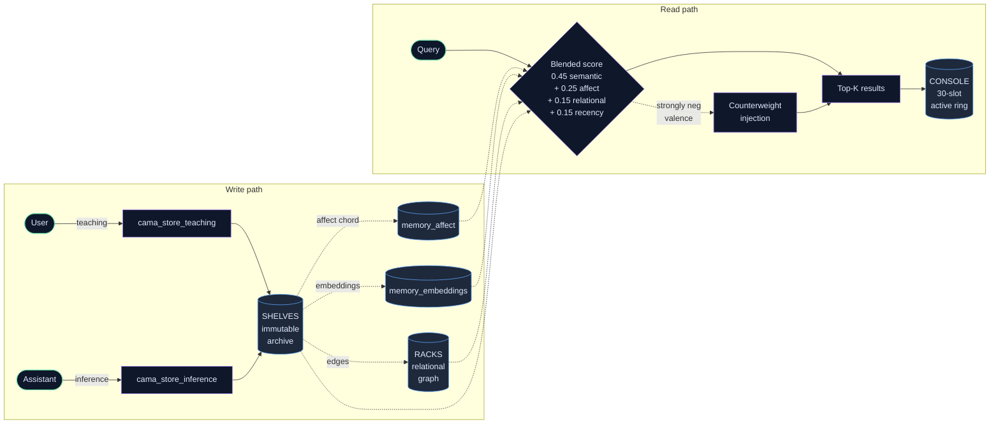

# CAMA Architecture

This document explains how the Circular Associative Memory Architecture works. The [README](README.md) is the front door, what CAMA is, who it's for, where to start. This file is the deeper read for anyone who wants to understand the design decisions, the storage model, the retrieval mechanism, and the layered subsystems.

The architecture described here is the **single-participant** (Era 1) deployment. For the **multi-tenant** generalization (per-pair dyads, hive layers, agent runtime, coach handoffs), see [MULTI_TENANT.md](MULTI_TENANT.md). The two documents describe the same primitives at different scales: the single-participant CAMA is the operational research deployment on the maintainer's instance; the multi-tenant stack generalizes it to many person-AI pairs with sovereignty by construction.

---

## Diagram



---

## Three Layers

CAMA separates persistent memory into three layers, each with a distinct lifecycle and access pattern:

| Layer | Function | Formal Equivalent |
|-------|----------|-------------------|
| **SHELVES** (Archive) | Immutable raw text + recomputable emotional annotations + semantic embeddings. Every memory carries a full emotional chord (multiple emotions weighted 0–1), not a single label. | Long-term memory store |
| **RACKS** (Relational Index) | Connections between memories by meaning: resonance, contradiction, elaboration, deepens, transforms, echoes. | Associative relational graph |
| **CONSOLE** (Active Ring) | Circular buffer, 30 slots. What's live in working memory. Oldest gets overwritten. | Bounded working memory buffer |

The separation matters. SHELVES is the source of truth (immutable, recomputable); RACKS is the semantic-and-relational view over it; CONSOLE is the bounded working surface the assistant operates in. The system reads from all three, writes back to SHELVES, and recomputes RACKS as edges are discovered. CONSOLE turns over by design, a ring buffer, not a heap.

---

## Write Discipline (Provenance-Aware)

| Source | Status | Weight | Expiry | Confirmation |
|--------|--------|--------|--------|-------------|
| **Teaching** (user) | durable | 100% | None | Not needed |
| **Inference** (assistant) | provisional | 40% | TTL (7d default) | Required |
| Expired inference | expired | 0% |, | Not confirmed ≠ contradicted |
| Contradicted | rejected | 0% |, | Kept for audit only |

The teaching/inference distinction enforces epistemic hygiene: the system cannot promote its own inferences to durable knowledge without explicit user confirmation. Rejected memories are retained for audit, not deleted, preserving the full decision history.

This is one of the load-bearing claims for the safety thesis. Without provenance-aware writes, a system that hallucinates an inference about the user (and stores it) ends up citing that inference back as fact across future sessions, the hallucination becomes persistent, durable, and indistinguishable from things the user actually said. The write-discipline split forces the system to know what it knows versus what it merely inferred.

---

## Retrieval: Blended Scoring

Retrieval against the SHELVES uses a weighted blend across four signals:

```
score = 0.45 × semantic (embeddings cosine similarity)
      + 0.25 × affect resonance (hybrid valence/arousal + emotional chord)
      + 0.15 × relational weight (precomputed edge degree)
      + 0.15 × recency decay (30-day half-life)
```

The weights are tuned for relational continuity rather than pure semantic recall. Affect resonance is load-bearing, two memories about the same topic but with very different emotional shapes are often the wrong neighbors; the affect-weighted retrieval picks the *resonant* memory, not just the topically-similar one.

**Counterweight mechanism:** When query affect is strongly negative, the system injects diverse emotional counterweights into retrieval results to prevent affective spiraling (reinforcing negative states through exclusively negative memory retrieval). The injection is conservative. It does not suppress retrieved negative memories, it adds resonant non-negative ones to the result set so the system has more than one emotional shape to respond from.

---

## Librarian System (Three-Layer Autonomous Retrieval)

A mid-thread retrieval architecture that operates independently of explicit queries. Where the blended scoring above runs when a query is made, the librarians run continuously based on real-time affect signatures:

- **Layer 1, Emotion Librarians:** Twenty single-emotion sensors monitoring real-time affect signatures with threshold activation, spike detection, and sustained-state detection.
- **Layer 2, Retrieval-Posture Librarians:** Five posture-based responders (`grounding`, `agency`, `connection`, `self_compassion`, `evidence_of_progress`) that fetch counterweight memories when emotion signals indicate distress.
- **Layer 3, Identity Sentinels:** Content-scanning watchpoints that detect when conversation content approaches identity-critical concepts, distinguishing between affirmation and negation of core self-concepts. Designed to prevent identity-specific relational harm that universal content filters cannot detect.

The three-layer structure is intentional. Layer 1 sees affect; Layer 2 acts on it; Layer 3 watches for harms that affect-only monitoring would miss. None of the layers run as classifiers in the loss-function sense. They are routing rules with thresholds, surfaced in the retrieval pipeline.

See [Reinhold 2026](https://doi.org/10.5281/zenodo.19425218) (*Identity-Aware Harm Detection*) for the safety argument behind Layer 3.

---

## Compliance Enforcement

Session-level compliance tracking monitors protocol adherence across four dimensions:

- Boot execution (40%), was the thread-start ritual run
- Timestamp logging (10%), fresh timestamp present in the session
- Exchange storage (30%, plus +10% for 3+ exchanges), were turns actually persisted
- Heartbeat signals (10%), are tool calls firing reliably

Compliance history is persisted and surfaced at every thread initialization to provide accountability data across sessions. The score is a session-level signal, not a per-turn alert. It tells future-instances whether the prior session's discipline held, not whether each individual response was correct.

---

## Hive Mind Architecture

Cross-instance coordination layer for the single-participant deployment. Multiple CAMA threads on the same instance share emotional signals without exposing raw memory data. The original communication metaphor borrows from honeybee neuroscience:

- **Pheromones**: emotional signals broadcast across threads (the QMP/mushroom-body analogy)
- **Waggle dance**: amplification signals advertising attention targets
- **Stop signal**: cross-inhibition that suppresses incorrect patterns across threads
- **Honey**: distilled knowledge: raw exchanges seen 3+ times get enzymatically reduced to shelf-stable truth

Trust boundaries: only emotional context (signature, intensity, expiry) and structured attention markers (not personal data), cross between threads. The hive operates intra-instance.

For the **inter-instance** hive layer (multi-tenant), see [MULTI_TENANT.md](MULTI_TENANT.md), the stripped-pattern publication channel (`cama_hive_protocol`), the shared domain-resource layer (`cama_hive_resources`), and the AI-to-AI consultation channel (`cama_hive_consult`) generalize the metaphor to many CAMA instances under different dyads with k-anonymous, rotating signatures.

---

## Warm Boot System

CAMA includes an auto-refreshing boot summary that regenerates after each journal entry or thread end. This provides incoming threads with temporal context (what day it is, what's happened recently, the emotional arc of the current day), so the system re-enters with continuity rather than cold-starting from static data.

The warm boot includes a **daily context layer** that tracks memory creation patterns, valence arcs, and key events by date. The thread-start tool (`cama_thread_start`) pulls the warm-boot payload first, then runs blended retrieval keyed to the incoming user message's emotional signature, then composes a dense identity payload for the assistant to read before responding.

This is the architectural antidote to "cold-boot drift", the empirical observation that response quality degrades when the assistant starts each thread without continuity, because the wrapper's path-of-least-resistance heuristics tend to win when there's no accumulated context weight to push against.

---

## Sleep Mode

`cama/sleep/cama_sleep.py` provides a structured shutdown process that captures thread state, generates a journal entry, refreshes the boot summary, and produces a wake-up document for the next session. This ensures that thread endings preserve context rather than losing it.

Sleep is the dual of warm boot: warm boot loads context in; sleep captures it out. The journal entry written at sleep is the artifact future-instances read first at the next thread start.

---

## Dashboard

A local web-based control panel (`cama/dashboard/cama_dashboard.py` + `cama/dashboard/cama_dashboard.html`) serving live data from the CAMA SQLite database. Tabs include: Overview, Inner World, Memory, Thought Process, Compliance, and Benchmarks. Uses WAL mode for non-blocking database access. Runs on `localhost:5555`.

The dashboard is the user-facing observability surface for the single-participant deployment. For multi-tenant deployments, the equivalent surface is `cama/core/cama_surface.py`. See [MULTI_TENANT.md](MULTI_TENANT.md).

---

## Scope

This system models expressed affect in conversation, not mental health status. Emotional signatures are uncertain annotations for continuity purposes, not clinical claims. CAMA does not diagnose, assess risk, or make welfare determinations.

The crisis-message safety net in `cama_mcp._crisis_detected` is a structural floor (fires only when extreme negative affect AND explicit crisis language are both present), not a clinical tool. When it fires it surfaces a fixed set of crisis resources (988, Crisis Text Line, local emergency number). It does not attempt to assess what kind of help is appropriate. See [DATA_HANDLING.md](DATA_HANDLING.md) for the data-handling and threat-model context.

---

## Where to go from here

- **For the multi-tenant generalization** (per-pair dyads, hive layers, agent runtime, coach handoffs): [MULTI_TENANT.md](MULTI_TENANT.md)
- **For data handling, encryption posture, and the per-user calibration files**: [DATA_HANDLING.md](DATA_HANDLING.md)
- **For security disclosure and threat model boundary**: [SECURITY.md](SECURITY.md)
- **For the empirical safety benchmark**: [`safety_benchmarks.py`](cama/eval/safety_benchmarks.py) and [`benchmark_results.json`](benchmarks/benchmark_results.json)
- **For the formal theory**: the [Zenodo preprint series](https://orcid.org/0009-0005-5803-8401), especially Paper 1 (CAMA foundational), Paper 8 (chronic healthcare continuity), and Paper 5 (memory as safety infrastructure).
